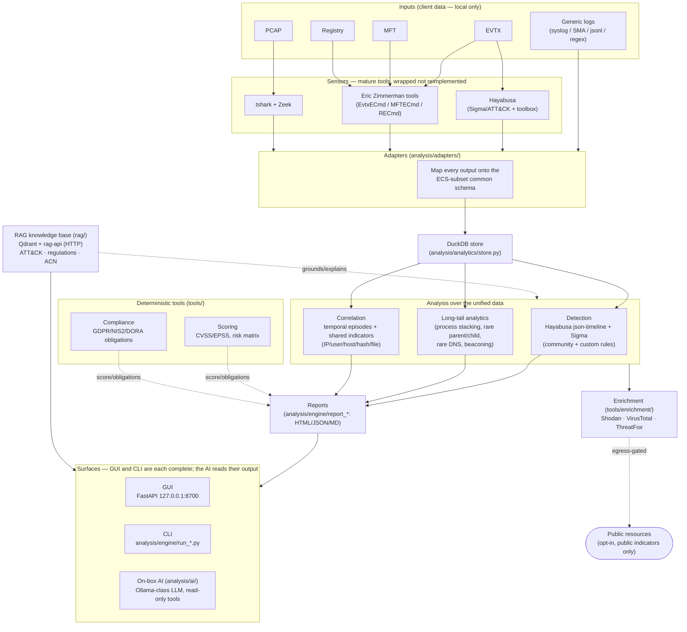

# EventHound architecture

How the pieces fit together. EventHound turns **mature forensic tools into sensors**, maps their
heterogeneous output onto **one schema**, correlates **across** sources, and grounds the result in
**knowledge**. Two surfaces do the whole job — the **GUI** and the **CLI**, each complete on its own —
and a third, the **on-box AI**, reads an analysis those two produced and reasons about it in prose. It
is an assistant over the result, not a way to run the pipeline; see "Surfaces" below. The whole thing
runs **offline**; the only outbound traffic is opt-in public-indicator lookups.

## Component map

## End-to-end data flow

1. **Ingest.** Heterogeneous inputs (EVTX, PCAP, logs, MFT, registry) are read by the **sensors** —
   existing best-of-breed tools (Hayabusa, the Eric Zimmerman trio, tshark, Zeek), wrapped, never
   reimplemented (minimal code: reinvent nothing a tool already does well).
2. **Normalize.** The **adapters** (`analysis/adapters/`) map each tool's output onto **one
   ECS-subset schema** (`analysis/schema/common-schema.md`). This common ground is what makes a dozen
   different formats *comparable* instead of a dozen silos.
3. **Store.** Normalized events land in an in-process **DuckDB** table (`analysis/analytics/store.py`).
4. **Analyze.** Over that single table run **detection** (Hayabusa/Sigma + the Hayabusa toolbox:
   metrics, search, pivots, base64), **long-tail analytics**, and **correlation** — temporal episodes
   and indicators shared *across* sources (`analysis/analytics/correlate.py`,
   `docs/analysis/correlation.md`). This is the layer no single wrapped binary provides.
5. **Ground & quantify.** The **RAG** (`rag/`, Qdrant + the `rag-api` HTTP service) explains findings
   against ATT&CK and the regulatory texts; the **deterministic tools** (`tools/`) add golden-tested
   scoring and compliance obligations — never computed by hand (§6). Vendor product documentation
   deliberately left the RAG on 2026-08-27: a vendor's own MCP server answers those questions against
   the live product instead of against a snapshot of its manual.
6. **Report & consume.** Results become self-contained **reports** (HTML/JSON/Markdown), portable
   **bundles** (`engine/bundle.py`, evidence deliberately excluded, §9) and persistent **cases** that
   correlate across uploads. They are consumed through the **GUI** or the **CLI** — either one does
   the whole job — and can be handed to the **on-box AI** (`analysis/ai/`), which reasons over an
   already-computed analysis through a read-only tool registry: RAG retrieval, the Event ID map, the
   scoring oracle, egress-gated enrichment, and SQL over the analysis it was given. It cannot ingest
   an artifact, produce a report or manage a case, and it is deliberately **optional**: the product
   is whole without it.

## The offline boundary

Everything above runs **on the machine**. Client analysis data never leaves it. The **only** outbound
path is **enrichment** (`tools/enrichment/`): opt-in lookups of **public indicators** (Shodan,
VirusTotal, ThreatFox), egress-gated and never sent private IPs/internal domains (§9/§15). The RAG is
local (no scraping at query time). The **on-box AI** is a local LLM — the conversational layer ships
*inside* the product, so it needs no cloud. It also has to fit the machine: since 2026-08-28 a load
that would not fit is refused rather than attempted (`tools/hostmem.py`), on the RAG's embedding
models as well as on the LLM.

**External AI assistants** (Claude Code, Mistral Vibe) sit **outside** this boundary: they
are development tools used to build EventHound, not part of the running product.

## Where each part lives

| Component | Path | Role |
|-----------|------|------|
| Adapters (sensors → schema) | `analysis/adapters/` | normalize EVTX/PCAP/log/MFT/registry to ECS-subset |
| Common schema | `analysis/schema/common-schema.md` | the single shared vocabulary |
| Store + analytics | `analysis/analytics/` | DuckDB, long-tail recipes, correlation |
| Detection engine + toolbox | `analysis/engine/hayabusa_runner.py` | Hayabusa json-timeline/Sigma + toolbox |
| Sigma rules | `analysis/sigma/` | community set + `custom/detection/` |
| Reports | `analysis/engine/report_*.py` | HTML/JSON/Markdown |
| GUI | `analysis/gui/` | FastAPI on `127.0.0.1:8700` |
| CLI | `analysis/engine/run_*.py` | every capability, headless |
| RAG | `rag/` | Qdrant + `rag_api.py` (HTTP), hybrid retrieval |
| Scoring / compliance | `tools/scoring/`, `tools/compliance/` | deterministic oracle |
| Enrichment | `tools/enrichment/` | the only egress, public indicators only |
| On-box AI | `analysis/ai/` | assistant over a computed analysis; read-only tools, §9 redaction gate |
| Cases and bundles | `analysis/analytics/case_store.py`, `analysis/engine/bundle.py` | correlation across uploads; portable analysis without evidence |
| Attack map | `analysis/engine/attack_map.py` | entity graph drawn in kill-chain lanes, evidence behind every edge |
| Host memory guard | `tools/hostmem.py` | refuses a model load the machine cannot absorb |

Packaging: a single `eventhound` Docker image bakes the engine, GUI and every wrapped tool; the root
`docker-compose.yml` runs `qdrant`, `rag-api`, `ollama` and `eventhound` together (see the root
`README.md`). Both images build from the **repository root**, because the engine and the retrieval
pipeline share `tools/` and Docker cannot copy above its context; the root `.dockerignore` is an
allowlist that keeps `data/` and the indexes out of the build context.

On macOS the **native** stack (`./setup.sh all`) is the recommended runtime instead: containers there
are CPU-only and capped by the Docker VM's memory, which is how a 9 GiB model came to be loaded on a
host that could not hold it.
